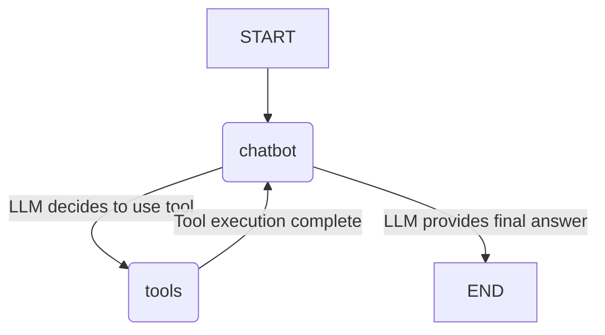

# Autonomous AI research Agent with Web Search Capabilities

## Project Title
Conversational AI Agent with Web Search

## Overview
This project implements a simple yet powerful conversational AI agent using LangGraph, Google Gemini, and Tavily Search. The agent is designed to engage in natural language conversations with users and, when necessary, leverage external web search capabilities to provide accurate and up-to-date information. It demonstrates how to orchestrate complex agent behaviors by chaining an LLM with external tools in a robust and stateful manner.

## Why this project
Large Language Models (LLMs) are incredibly powerful, but they often have limitations such as knowledge cutoffs (their training data isn't always current) and the inability to perform real-time actions. This project addresses these limitations by integrating an LLM with a web search tool.

The primary motivations for this project are:
*   **Enhanced Accuracy and Freshness:** By integrating Tavily Search, the agent can access real-time information from the internet, overcoming the knowledge cutoff of the LLM and providing more accurate and current answers.
*   **Problem Solving Beyond Internal Knowledge:** The agent can answer questions that require external data retrieval, expanding its utility beyond what's contained in its training data.
*   **Demonstration of LangGraph:** It serves as an excellent example of how to use LangGraph to build sophisticated, multi-step AI agents that can dynamically decide whether to use a tool or respond directly.
*   **Modular and Extensible Design:** The LangGraph framework promotes a modular design, making it easier to add more tools or complex decision-making logic in the future.

## Technologies Used
*   **Python:** The core programming language for the project.
*   **LangGraph:** A library for building stateful, multi-actor applications with LLMs, enabling the orchestration of complex agent workflows.
*   **LangChain:** Provides the foundational components for integrating LLMs and tools.
    *   `langchain_google_genai`: For interacting with Google's Gemini LLM.
    *   `langchain_community.tools.tavily_search`: For integrating the Tavily web search API as a tool.
*   **Google Gemini (gemini-2.5-flash):** The Large Language Model used for natural language understanding, generation, and decision-making.
*   **Tavily Search API:** A powerful web search API used by the agent to retrieve information from the internet.
*   **`python-dotenv`:** For securely loading environment variables (API keys) from a `.env` file.
*   **`typing` (TypedDict, Annotated):** For robust type hinting in Python.

## How it works
The agent's functionality is built around a state machine orchestrated by LangGraph. It maintains a conversational state and transitions between different nodes (LLM interaction, tool execution) based on the LLM's decisions.

### Core Components and Flow:

1.  **Environment Setup:**
    *   The project starts by loading API keys for Tavily Search and Google Gemini from a `.env` file using `python-dotenv`. This ensures sensitive information is not hardcoded.

2.  **Tool Initialization:**
    *   `TavilySearchResults` is initialized with the `TAVILY_KEY`. This tool allows the agent to perform web searches.

3.  **LLM Initialization:**
    *   `ChatGoogleGenerativeAI` is set up using the `gemini-2.5-flash` model. This LLM is chosen for its balance of speed and capability.
    *   Crucially, the LLM is "bound" with the `TavilySearchResults` tool using `llm.bind_tools(tools)`. This teaches the LLM about the available tool and how to call it.

4.  **State Definition (`State`):**
    *   A `TypedDict` named `State` is defined to manage the agent's internal state. It primarily holds a list of `messages`, which represents the entire conversation history.
    *   `Annotated[list, add_messages]` is a LangGraph-specific annotation that ensures new messages are correctly appended to the list, maintaining the conversational context.

5.  **Chatbot Node (`chatbot` function):**
    *   This function represents the core LLM interaction.
    *   It takes the current `state` (containing the message history).
    *   It invokes the `llm_with_tools` (the Gemini LLM bound with the Tavily tool) with the current messages.
    *   The LLM processes the messages and decides whether to:
        *   Generate a direct textual response.
        *   Call the `TavilySearchResults` tool (e.g., if the query requires external information).
    *   The function returns the LLM's output, which is then added to the state.

6.  **Tool Node (`tool_node`):**
    *   This node is responsible for executing any tools that the LLM decides to call.
    *   It's initialized with the list of available `tools` (in this case, `TavilySearchResults`).
    *   When the graph transitions to this node, it parses the tool call from the LLM's output and executes the corresponding tool. The results of the tool execution are then added to the conversation history.

7.  **Graph Construction (`StateGraph`):**
    *   A `StateGraph` is initialized with the defined `State`.
    *   **Nodes:**
        *   `"chatbot"`: Corresponds to the `chatbot` function.
        *   `"tools"`: Corresponds to the `tool_node`.
    *   **Edges (Transitions):**
        *   `graph_builder.add_edge(START, "chatbot")`: The conversation always begins by sending the user's input to the `chatbot` node.
        *   `graph_builder.add_conditional_edges("chatbot", tools_condition)`: This is the crucial decision point. After the `chatbot` node processes the input:
            *   If the LLM's response contains a tool call, `tools_condition` directs the graph to the `"tools"` node.
            *   If the LLM's response is a final answer (no tool call), `tools_condition` directs the graph to `END`.
        *   `graph_builder.add_edge("tools", "chatbot")`: After a tool is executed, its results are fed back into the `chatbot` node. The LLM can then use these results to formulate a final answer or decide on further actions (e.g., another tool call if the first one wasn't sufficient).
    *   **Compilation:** `graph_builder.compile()` finalizes the graph, making it ready for execution.

8.  **Interactive Execution (`if __name__ == "__main__":`)**
    *   The main block provides a command-line interface for users to interact with the agent.
    *   It enters an infinite loop, prompting the user for input.
    *   `graph.stream({"messages": [("user", user_input)]})` executes the compiled graph with the user's message. `stream` allows for real-time output as the agent processes the request.
    *   The agent's responses (including tool outputs and final answers) are printed to the console.

### Flow Diagram (Conceptual):



## Installation Instructions

Follow these steps to set up and run the Conversational AI Agent locally.

### Prerequisites
*   Python 3.9+
*   A Google Cloud Project with the Gemini API enabled.
*   A Tavily API Key.

### Step 1: Clone the Repository (or create the file)
If you have a repository, clone it:
```bash
git clone <repository_url>
cd <repository_directory>
```
Otherwise, create a file named `agent.py` (or any other name) and paste the provided code into it.

### Step 2: Create a Virtual Environment (Recommended)
It's good practice to use a virtual environment to manage dependencies.
```bash
python -m venv venv
source venv/bin/activate  # On Windows: venv\Scripts\activate
```

### Step 3: Install Dependencies
Install the required Python packages using pip:
```bash
pip install python-dotenv langchain-community langchain-google-genai langgraph
```

### Step 4: Set Up Environment Variables
You need to provide your API keys for Google Gemini and Tavily Search.
1.  Create a file named `.env` in the same directory as your `agent.py` file.
2.  Add your API keys to this file in the following format:

    ```env
    TAVILY_KEY="your_tavily_api_key_here"
    LLM-API-KEY="your_google_gemini_api_key_here"
    ```
    *   **Tavily API Key:** You can get one from [Tavily AI](https://tavily.com/).
    *   **Google Gemini API Key:** You can get one from [Google AI Studio](https://aistudio.google.com/app/apikey).

### Step 5: Run the Agent
Execute the Python script from your terminal:
```bash
python agent.py
```

The agent will start, and you'll see a prompt:
```
🤖 Agent is Ready! (Ctrl+C to quit)

💬 Your Question:
```
You can now type your questions. To exit the agent, type `exit` or `quit`.